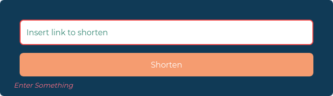

# ShortLink Website
ShortLink Product home page from Udemy Course: TailwindCSS from Scratch and from Frontend Mentor Challenge.

This is a homepage design that showcases a link generation and customization offering. This project utilizes TailwindCLI.

This is a frontpage design that emulates the home page of a SaaS based product that is used to create, customize, monitor and manage the custom links (similar products like bit.ly, cut.ly etc,). This project also involved creation and editing of some custom svg files.

It also features a hamburger menu for smaller devices that envelops the nav bar menu and shows instead a menu and a http link validation such that if the link entered is invalid it shows appropriate response. Both of them are achieved using custom CSS classes and DOM via Vanilla JavaScript.

The design catalogue base is taken from Frontend Mentor. The modifications are inspired from joturl.com and cuttly.com, both of whom offer link customization and link management tools.

## Made Using:


## Usage
Install Dependencies:
```
npm install
```
Run Tailwind CLI:
```
npm run watch
```

## Screenshots
### Web-View


### Mobile View


### Menu in Mobile View


### Validation
#### When the form is empty


#### When the url is not correct
